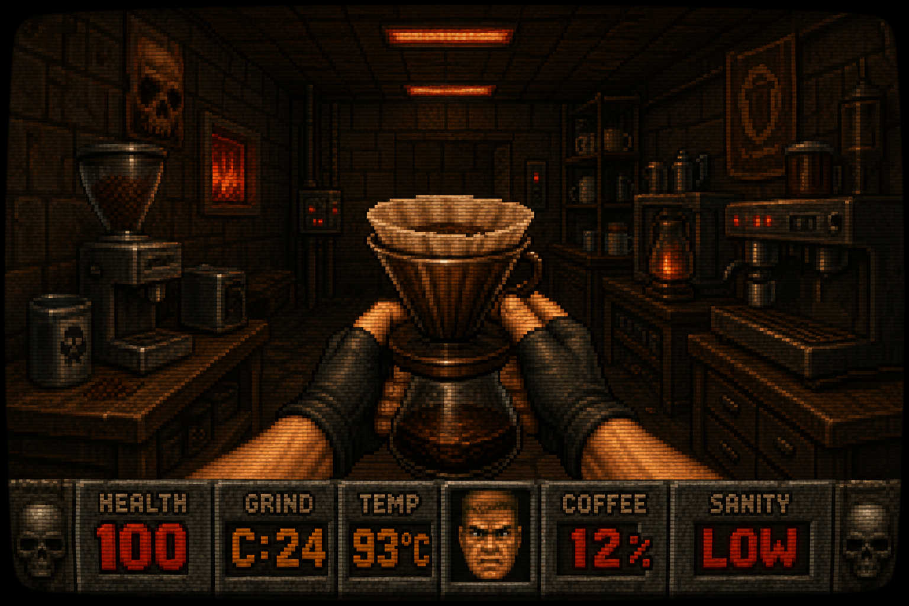

# ☠️ BREW LAB

### _"In the dark corners of the multiverse, there exists a machine. It doesn't just brew coffee — it perfects it. Each cup, a ritual. Each dial, a weapon. The beans scream as they're ground. The water boils with purpose. And when the extraction is complete... you taste God."_

---
<div align="center">
  
</div>

**You don't drink coffee. You extract intelligence from dead plant matter using controlled thermal violence.**

---

## 🔥 WHAT IS THIS THING

Brew Lab is a **self-evolving coffee recipe engine** built by a madman who refused to drink another mediocre cup. It runs on your phone like a PWA, talks to an AI when it needs to think, and learns from every single brew you make.

It started as a conversation. A man. A V60. A Commandante grinder. And a relentless need to understand why his Sumatran peach coferment tasted like dirt at the wrong temperature. Hundreds of brews later, the knowledge became a system. The system became an app. The app became... **this**.

```
   CURRENT LOADOUT
   ├── Hario V60 ──────── Filter Ops
   ├── Bialetti Brikka ── Pressure Ops  
   ├── Commandante C40 ── Particle Control
   ├── Infrared Burner ── Thermal Platform
   └── Claude AI ──────── Neural Advisory
```

---

## 💀 CORE SYSTEMS

### `EXTRACTION ENGINE`
Every bean has a kill zone — a narrow window where temperature, grind, and pour technique converge to produce perfection. Too cold, and you get sour corpse water. Too hot, and you burn the aromatics into ash. Brew Lab finds the kill zone.

- **V60 Protocol** — Hot or iced. Layered, descending, or even pours. Commandante clicks dialed to the bean's DNA.
- **Brikka Protocol** — Pressure extraction. 1600W infrared. Straight shot, americano, or iced. Pull at the sputter or die trying.

### `FEEDBACK LOOP` 
The machine learns. After every brew, you report:

```
┌─────────────────────────────────────┐
│  HOW WAS IT?                        │
│                                     │
│  [✓ PERFECT]  ← locks the recipe    │
│                                     │
│  [ sour ] [ bitter ] [ acrid ]      │
│  [ thin ] [ too acidic ]            │
│  [ flat/muddy ] [ missing notes ]   │
│                                     │
│  Select all that apply.             │
│  The engine adjusts.                │
│  Brew again.                        │
│  Repeat until perfection.           │
└─────────────────────────────────────┘
```

Contradictions are detected. Sour + bitter = channeling. The app doesn't change your grind — it tells you your bed prep is wrong. It knows.

### `SMART DEFAULTS`
New bean? The engine reads its origin, variety, process, and tasting notes, then calculates a starting recipe before you even brew. Kenyan fruity? 22 clicks, 91°C, descending pours. Brazilian chocolate? 24 clicks, 93°C, even pours. It's not guessing — it's pattern-matching against a database of dialed recipes.

### `NEURAL ADVISORY (AI)`
When the local rules engine can't figure it out — when you've got some unholy cofermented Liberica-Robusta hybrid that breaks every pattern — the app calls Claude. The AI doesn't give generic advice. It knows your grinder, your burner, your wattage, your click range. It speaks Commandante.

---

## 🎯 THE ARSENAL — DIALED RECIPES

Every bean below has been tested, adjusted, re-brewed, and locked through the feedback loop.

```
BEAN                            TEMP    CLICKS   METHOD          STATUS
─────────────────────────────────────────────────────────────────────────
Colombia Coferment              93°C    24       V60 Layered     ██████████ LOCKED
Aalamin Sumatra Peach            91°C    26       V60 Layered     ██████████ LOCKED  
Camel Step Tacu Mexico          94°C    24       V60 Even        ██████████ LOCKED
Colombia 722                    92°C    24       V60 Descending  ██████████ LOCKED
Colombia Piña Colada            93°C    24       V60 Descending  ██████████ LOCKED
İstinye Papua New Guinea        91°C    24       V60 Descending  ██████████ LOCKED
Malaysia Liberica Tobacco       90°C    24       V60 Even        ██████████ LOCKED
Brazil Yellow Catuai Infused     —      13       Brikka          ██████████ LOCKED
Camel Step Brazil Santos         —      13       Brikka          ██████████ LOCKED
Ethiopia Chelbesa                —      14       Brikka          ██████████ LOCKED
Brazil Parainema                 —      13       Brikka          ██████████ LOCKED
Brazil Santa Ines                —      13       Brikka          ██████████ LOCKED
Liberica Tobacco                 —      14       Brikka          ██████████ LOCKED
```

---

## 🧬 THE PHILOSOPHY

```
                    ┌──────────────┐
                    │   NEW BEAN   │
                    └──────┬───────┘
                           │
                    ┌──────▼───────┐
                    │ SMART DEFAULTS│
                    │ (origin,      │
                    │  process,     │
                    │  variety)     │
                    └──────┬───────┘
                           │
                    ┌──────▼───────┐
                    │  FIRST BREW  │
                    └──────┬───────┘
                           │
                    ┌──────▼───────┐
              ┌─────┤  FEEDBACK    ├─────┐
              │     └──────────────┘     │
              │                          │
       ┌──────▼──────┐          ┌────────▼────────┐
       │  PERFECT?   │          │  ISSUES?        │
       │  Lock it.   │          │  Adjust clicks, │
       │  Done.      │          │  temp, or pour. │
       └─────────────┘          └────────┬────────┘
                                         │
                                  ┌──────▼───────┐
                                  │  BREW AGAIN  │
                                  └──────┬───────┘
                                         │
                                    (repeat until
                                     perfection)
```

---

## 🛸 FUTURE TRANSMISSIONS

This is V3. The architecture is designed to scale beyond one grinder, one brewer, one human.

```
ROADMAP
├── v4 ── AI in feedback loop, not just recipe screen
├── v5 ── Multi-grinder support (Commandante, Sage, EK43, whatever you bring)
├── v6 ── Multi-brewer support (espresso machines, AeroPress, French press, Chemex)
├── v7 ── Bean library with community-sourced profiles
├── v8 ── Flavor wheel integration — map your cup against SCA standards
└── v∞ ── The perfect cup. Every time. Any bean. Any setup. Anywhere.
```

> _"I used to think coffee was a beverage. Now I understand it's an extraction problem with a delicious solution."_

---

## ⚡ INSTALLATION

```bash
# There is no installation. There is only deployment.

1. Clone this repo
2. Open index.html in Safari on your iPhone
3. Share → Add to Home Screen
4. Enter your Anthropic API key in Settings
5. Select a bean
6. Brew
7. Feed back
8. Repeat until you achieve transcendence
```

---

## 🔧 TECH STACK

No frameworks. No build tools. No node_modules black hole. Just:

- **One HTML file.** That's it. That's the app.
- **Vanilla JS.** The engine runs on raw JavaScript and localStorage.
- **Anthropic Claude API.** For when the local brain isn't enough.
- **PWA manifest.** So it lives on your home screen like it belongs there.

```
Total dependencies: 0
Bundle size: one file
Build step: what build step
```

---

## ☕ THE BEANS SPEAK

```
"The Liberica doesn't taste like coffee. It tastes like 
jackfruit and leather had a baby in a tobacco field, and 
that baby grew up to have a bourbon aftertaste."

"The Parainema hit different. Not because it tasted 
better — because the Robusta DNA gave it a caffeine 
payload that the pure Arabicas couldn't match."

"91 degrees. That's where the osmanthus lives. 
One degree higher and it's gone. One degree lower 
and you're drinking grass."
```

---

<p align="center">
  <strong>BREW LAB v3.0</strong><br>
  <em>Extraction Protocol Active</em><br>
  <code>[ GRINDING // HEATING // EXTRACTING // PERFECTING ]</code>
</p>

---

<p align="center">
  <sub>Built with obsession, caffeine, and Claude. No beans were harmed. Many beans were perfected.</sub>
</p>
